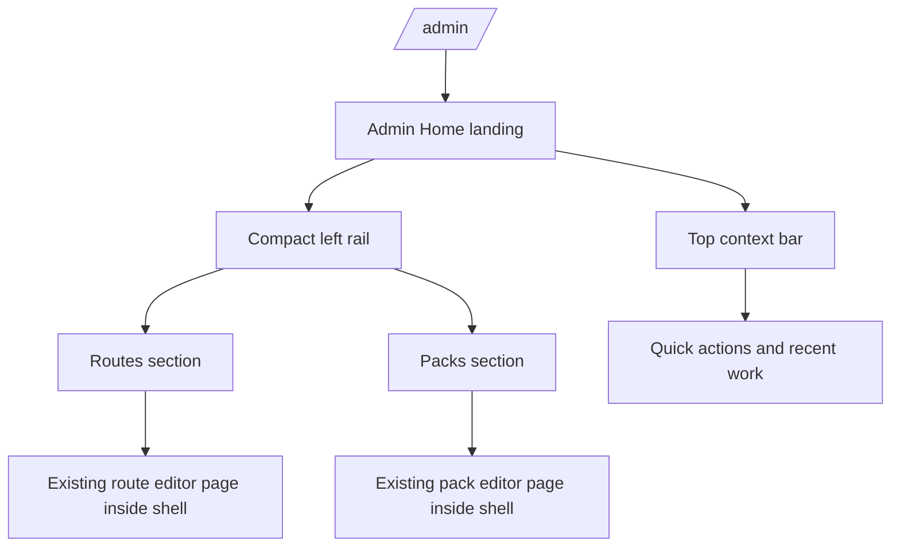

# Admin Workspace Shell

## Problem Frame

Текущая админка уже содержит полезные редакторские поверхности, но они ощущаются как отдельные большие страницы, а не как единая рабочая среда. Администратор попадает в `Маршруты` или `Подборки` почти напрямую, быстро теряет контекст, и каждый новый переход ощущается как смена экрана, а не продолжение одной и той же задачи.

Это особенно заметно сейчас, когда админский контур начинает расти: уже есть `routes`, `route packs`, валидация, preview-элементы и всё больше разных editor-сценариев. Без общего shell-а каждая новая admin feature будет добавлять ещё один isolated screen и ещё сильнее увеличивать cognitive load.

`Admin Workspace Shell` нужен не для косметики, а для смены модели работы: админка должна стать единым workspace с понятным home, устойчивой навигацией, явным текущим контекстом и быстрыми переходами в частые задачи.

## Requirements

**Shell Structure**
- R1. Система должна дать админке единый `Admin Workspace Shell`, который становится общей оболочкой для основных admin-разделов, а не только локальной навигацией между двумя editor pages.
- R2. Первой точкой входа в админку должна стать отдельная landing surface через `Admin Home`, а не прямой вход в страницу маршрутов или подборок.
- R3. На desktop shell должен использовать `hybrid` navigation pattern: компактный left rail для top-level sections и отдельный верхний context layer для текущего раздела и действий.
- R4. В первой версии shell должен оставаться видимым даже во время глубокой правки маршрута или pack; отдельный focus mode не вводится.

**Navigation and Context**
- R5. Left rail должен давать как минимум устойчивый доступ к `Admin Home`, `Маршрутам` и `Подборкам`.
- R6. Shell должен явно показывать текущий контекст: где находится администратор, какой раздел открыт и с какой сущностью он сейчас работает, если редактирование уже началось.
- R7. Переход между top-level sections не должен создавать ощущение “выхода из одной системы и входа в другую”; визуальный каркас, навигационные принципы и контекстный слой должны оставаться консистентными.
- R8. На меньших экранах shell должен деградировать в более компактный navigation pattern, сохраняя доступ ко всем top-level sections без разрушения общей IA.

**Quick Actions**
- R9. В первой версии shell должен включать не только layout, но и быстрые действия для частых admin-задач.
- R10. Quick actions должны покрывать как минимум старт новых сущностей и быстрый возврат в недавнюю или текущую работу, чтобы shell ощущался рабочим инструментом, а не только frame around pages.
- R11. Shell должен уметь показывать recent work или аналогичный resume-layer, чтобы администратор мог быстрее возвращаться к незавершённым или недавно открытым задачам.
- R12. Quick actions должны усиливать существующие editor flows, а не заменять редакторы встроенным heavy workflow внутри shell.

**Integration Strategy**
- R13. В первой версии shell должен оборачивать уже существующие страницы `Маршруты` и `Подборки`, а не требовать их полного перепроектирования до запуска.
- R14. Вместе с оболочкой допускаются локальные улучшения внутри существующих страниц там, где это materially нужно для согласованности shell experience.
- R15. Shell должен стать естественной основой для дальнейшего роста админки: preview-слоёв, readiness language, speed tools и новых admin surfaces, чтобы они воспринимались как части одного workspace, а не как отдельные спецэкраны.
- R16. Переход на shell не должен ломать уже существующие редакторские возможности: редактирование маршрутов, точек, QR, preview карты и редактирование packs должны остаться доступными в привычном функциональном объёме.

## Success Criteria

- Администратор входит в единый admin workspace, а не “проваливается” сразу в одну из editor pages.
- Навигация между `Admin Home`, `Маршрутами` и `Подборками` становится устойчивой и предсказуемой.
- Existing route и pack editors ощущаются частями одной системы, даже если их внутренний layout пока перестроен только частично.
- Частые задачи стартуют быстрее за счёт quick actions и resume-layer.
- Новый shell создаёт прочную UX-основу для дальнейшего роста админки, не требуя отдельной навигационной модели под каждую новую feature.

## Scope Boundaries

- В первой версии feature не вводит command palette, глобальный поиск или полноценный command layer.
- В первой версии feature не требует полного redesign-а страниц `Маршруты` и `Подборки`.
- В первой версии feature не вводит отдельный focus mode, скрывающий shell во время глубокой правки.
- В первой версии feature не вводит отдельный publish-centric центр и не меняет publish-логику сам по себе.

## Key Decisions

- `Admin Home as landing`: shell начинается с admin home, а не с route editor, чтобы админка воспринималась как workspace.
- `Hybrid navigation`: основой desktop IA становится compact left rail плюс top context bar, а не только tabs или только top navigation.
- `Persistent shell`: даже в глубокой правке навигационный каркас остаётся живым и не исчезает.
- `Layout plus quick actions`: первая версия должна улучшать не только внешний frame, но и скорость реальной работы.
- `Mixed adoption`: shell оборачивает существующие pages и допускает точечные локальные улучшения, но не требует тотального redesign before value.

## Dependencies / Assumptions

- Существующие разделы `Маршруты` и `Подборки` сохраняются как ключевые admin surfaces внутри shell.
- Новые admin surfaces после запуска shell должны естественно встраиваться в него как в общую рабочую среду, а не строить собственную навигационную модель.
- Existing top-level app navigation уже содержит admin entry, но его IA может быть переработана в пользу нового workspace entrance.

## Outstanding Questions

### Resolve Before Planning
- None.

### Deferred to Planning
- [Affects R8][Technical] Как именно shell должен схлопываться на tablet/mobile, чтобы не потерять рабочую ориентацию и при этом не занять весь экран chrome-элементами?
- [Affects R10, R11][Technical] Какие quick actions и recent-work signals можно собрать из уже существующего состояния приложения в первой версии, а какие потребуют отдельного data layer?
- [Affects R14][Technical] Какие локальные улучшения внутри `AdminRoutes` и `AdminRoutePacks` дают наибольший UX-эффект уже в первой версии shell без взрыва scope?

## Next Steps
→ `/prompts:ce-plan` for structured implementation planning
