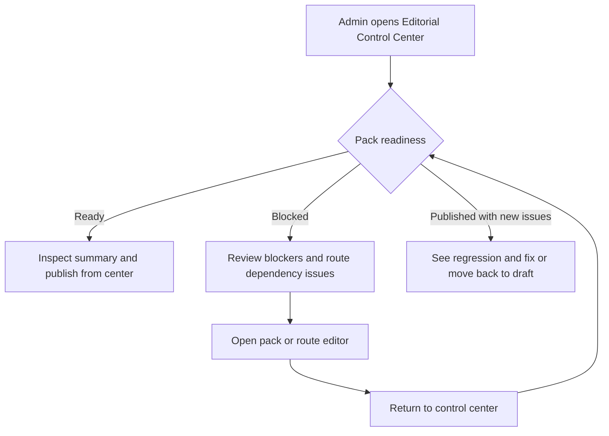

# Editorial Control Center

> Archived on 2026-04-01. This concept is no longer part of the active admin direction and is kept only as brainstorming history.

## Problem Frame

После появления `route packs` админка перестала быть набором независимых CRUD-экранов. Теперь публикация зависит не только от статуса pack, но и от состояния связанных маршрутов, а сама release-логика разбросана между разными страницами.

Сейчас администратор может редактировать `routes` и `packs`, но ему трудно быстро ответить на три главных вопроса:

- что уже готово к публикации;
- что заблокировано и почему;
- что уже опубликовано, но стало проблемным после изменений в связанных маршрутах.

Из-за этого publish decision получается слишком “ручным”: нужно помнить скрытые зависимости, переходить между экранами и самостоятельно проверять, не исчезнет ли pack из public experience. Для контентного продукта это уже не просто UX-шероховатость, а риск редакторских ошибок и сломанного пользовательского сценария.

## Requirements

**Center Role**
- R1. Система должна дать администратору отдельный `Editorial Control Center` как основной вход в admin-контур публикации, а не как ещё один вспомогательный экран рядом с редакторами.
- R2. Центр должен быть publish-centric: его первичная задача — помогать принимать и выполнять решения о публикации packs, а не служить общим dashboard всей админки.
- R3. Центр должен показывать queue в понятных состояниях как минимум для `ready to publish`, `blocked` и `published with issues`, чтобы администратор мог сразу отличать готовые релизы от проблемных.

**Readiness Model**
- R4. В первой версии primary publish entity должна быть `pack`; маршруты не становятся самостоятельными publish-единицами внутри этого feature.
- R5. Для каждого pack центр должен показывать readiness связанных маршрутов как dependency layer: какие маршруты поддерживают pack, какие из них требуют правки и какие проблемы мешают pack быть безопасно опубликованным.
- R6. Система должна различать `blockers` и `warnings`; blockers запрещают прямую публикацию из центра, warnings не блокируют publish, но остаются видимыми редактору.
- R7. Все readiness-сообщения должны быть action-oriented: администратор должен видеть не просто “есть проблема”, а какую сущность она затрагивает и что именно мешает публикации.
- R8. Центр должен отдельно подсвечивать уже опубликованные packs, которые после изменений в связанных маршрутах стали проблемными или исчезли из корректного public-состояния.

**Workflow and Actions**
- R9. Из центра администратор должен иметь быстрый переход в существующие редакторы маршрутов и packs для исправления найденных blockers, без дублирования полноценного inline-редактирования в самом центре.
- R10. Если draft pack не имеет blockers, администратор должен иметь возможность опубликовать его прямо из центра без перехода в pack editor.
- R11. Если опубликованный pack стал проблемным или требует снятия с публикации, администратор должен иметь возможность вернуть его в draft прямо из центра.
- R12. Перед прямой публикацией или снятием с публикации центр должен давать компактный inspectable summary: статус, ключевые blockers/warnings, связанные маршруты и достаточный контекст для уверенного решения без полного открытия editor page.

## Success Criteria

- Администратор может с одного экрана понять, какие packs готовы к публикации, какие заблокированы и какие уже опубликованные сценарии требуют вмешательства.
- Для publish-ready pack путь до публикации сокращается до review в центре и одного явного действия, без обязательного возврата в editor page.
- Зависимости pack от маршрутов становятся видимыми до публикации и после проблемных route-изменений.
- Центр уменьшает число “скрытых” редакторских ошибок, когда pack считается готовым формально, но фактически не проходит publish readiness.

## Scope Boundaries

- В первой версии feature не вводит полноценный publish lifecycle для маршрутов.
- Центр не заменяет существующие страницы редакторов маршрутов и packs.
- В первой версии центр не включает release bundles, batch publishing нескольких сущностей и editorial calendar.
- В первой версии feature не вводит multi-role review process или отдельные роли редактора/ревьюера/паблишера.

## Key Decisions

- `Pack-first publishing`: publish queue строится вокруг packs, потому что именно они уже несут редакторский статус и выступают публичной сценарной единицей.
- `Routes as dependencies, not entities`: readiness маршрутов видна внутри publish decision, но не превращает routes в отдельный lifecycle в первой версии.
- `Hybrid workflow`: публиковать и снимать с публикации можно прямо из центра, а исправлять контент нужно через существующие editor pages.
- `Control center as admin entry point`: центр должен восприниматься как новый главный вход в admin publishing workflow, а не как вторичный инструмент.

## Dependencies / Assumptions

- Существующий статусный слой packs (`draft` / `published`) сохраняется и становится основой queue.
- Readiness связанных маршрутов в первой версии вычисляется как derivative signal поверх уже существующего контента и validation-логики, а не через новый route-status model.
- Existing route editor и pack editor остаются основными местами для содержательных правок.

## Outstanding Questions

### Resolve Before Planning

- None.

### Deferred to Planning

- [Affects R5, R6][Technical] Какие именно route-level signals в первой версии считаются blockers, а какие warnings для pack publish readiness?
- [Affects R9][Technical] Насколько глубокими должны быть deep links из центра: до editor page целиком или до конкретного проблемного блока/секции?
- [Affects R1][Technical] Как лучше встроить новый центр в существующую admin navigation: новый route `/admin`, redirect с текущего entry point или отдельная вкладка над существующими editors?

## Next Steps

→ Archived. Do not use this document for planning unless this direction is explicitly reopened.
