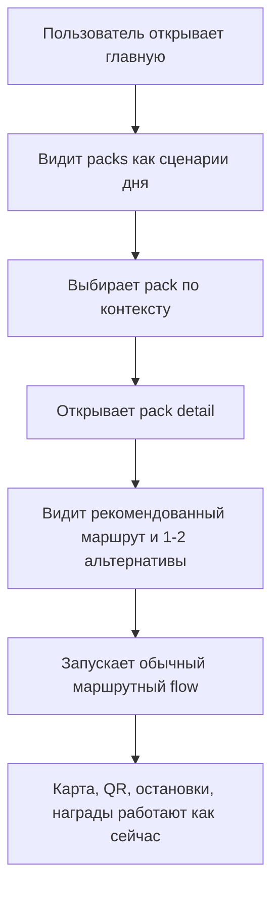

# Route Packs Instead of Single Routes

## Problem Frame

Сейчас продукт предлагает пользователю в первую очередь список отдельных маршрутов. Это хорошо работает для уже мотивированного пользователя, который готов сравнивать темы, длину и количество точек, но слабее работает для живой туристической ситуации: "у нас есть полтора часа", "мы с детьми", "идёт дождь", "хочется история плюс кофе", "нужна спокойная прогулка без перегруза".

В текущем проекте уже есть сильная основа для выбора: темы маршрутов, длительность, длина, optional stops, сохранённые маршруты и полноценный маршрутный flow. Проблема не в отсутствии контента, а в том, что контент упакован как каталог маршрутов, а не как готовые сценарии дня.

Цель фичи: добавить поверх существующих маршрутов сценарный слой `Route Packs`, который помогает пользователю начать не с "какой маршрут выбрать?", а с "какой формат прогулки мне подходит сейчас?".

## Approaches Considered

| Approach | Summary | Pros | Cons | Verdict |
|---|---|---|---|---|
| Editorial overlay on existing routes | Packs живут как отдельный discovery-слой поверх существующих маршрутов | Быстро запускается, использует уже существующие route metadata, не ломает текущий flow | Требует кураторской работы и хорошего редакторского слоя | Recommended |
| Named filter presets | Packs по сути являются красивыми сохранёнными фильтрами | Самый дешёвый путь, почти без новой модели | Слишком тонко ощущается, мало отличий от текущей фильтрации | Rejected for v1 |
| Fully scripted multi-route experiences | Pack управляет несколькими маршрутами, переходами и этапами дня | Самая сильная дифференциация и storytelling | Слишком большой скачок сложности для первой версии | Deferred |

## Requirements

**Pack Concept**
- R1. Продукт должен ввести `Route Pack` как отдельную сценарную единицу выбора поверх отдельных маршрутов.
- R2. Каждый pack должен описывать конкретный пользовательский контекст, а не только тему маршрута. Примеры контекстов: "первый визит", "семейная прогулка", "короткий слот времени", "дождливый день", "спокойный вечер".
- R3. В первой версии каждый pack должен курировать существующие маршруты, а не создавать новый самостоятельный путь с отдельной логикой точек, сканов и наград.
- R4. Один маршрут может входить в несколько packs, если он подходит разным сценариям.
- R5. Каждый pack должен содержать ясное обещание пользователю: для кого он, в каком состоянии или ограничении он полезен, и почему выбранные маршруты подходят именно под этот сценарий.

**Discovery Experience**
- R6. Главная страница должна показывать packs как first-class слой discovery, а не прятать их внутри существующих фильтров.
- R7. Карточка pack должна помогать быстро сравнивать сценарии и отвечать на вопрос "это для меня сейчас?", а не только дублировать route metadata.
- R8. Открытие pack должно показывать один рекомендованный маршрут и до двух альтернатив, если они действительно помогают выбору внутри сценария.
- R9. Пользователь, выбравший маршрут через pack, должен попадать в обычный маршрутный flow без отдельного режима прохождения.
- R10. Каталог отдельных маршрутов должен остаться доступным. Packs усиливают discovery, но не заменяют route browsing полностью.

**Curation and Editorial Control**
- R11. В админском или кураторском контуре должна появиться возможность создавать и редактировать packs без дублирования route content.
- R12. Куратор должен управлять порядком packs и тем, какие из них считаются featured на главной.
- R13. Первая версия должна запускаться с небольшим, намеренно отобранным набором packs, покрывающим разные сценарии, а не с большим каталогом слабых вариаций.
- R14. Pack не должен публиковаться пользователю в пустом или поломанном состоянии; если связанные маршруты больше не подходят, pack должен быть скрыт или явно требовать кураторского обновления.

**Scope and Behavior Decisions**
- R15. В первой версии пользователь сохраняет и проходит именно маршруты; отдельная механика "сохранить сам pack" не обязательна.
- R16. В первой версии recommendation внутри pack должна быть editorial-first: pack может подсветить лучший маршрут по мнению куратора, но не должен зависеть от алгоритмического ранжирования или персонального ML-подбора.

## Success Criteria
- Новый пользователь может начать выбор прогулки с pack-сценария и быстро дойти до запуска маршрута без необходимости сначала понимать весь каталог маршрутов.
- Первая версия packs покрывает несколько реально разных сценариев дня, а не только переименовывает существующие маршруты.
- Packs увеличивают понятность выбора и не создают второй, параллельный маршрутный продукт внутри приложения.
- Команда может добавлять и обновлять packs редакционно, без переписывания route content для каждого нового сценария.

## Scope Boundaries
- В v1 packs не создают новую логику прохождения, новые чекпоинты или отдельные reward loops.
- В v1 packs не являются user-generated объектами и не открывают маркетплейс пользовательских подборок.
- В v1 packs не зависят от алгоритмической персонализации, recommendation engine или автоматической генерации сценариев.
- В v1 фича не должна превращаться в большой redesign всей главной страницы; цель - усилить discovery, а не переписать весь продукт.
- В v1 не требуется отдельная коммерческая логика для packs, включая специальные pack-only цены, bundle checkout или pack-specific loyalty.

## Key Decisions
- `Editorial-first, not algorithmic`: pack должен ощущаться как кураторский сценарий, а не как тонкая обёртка вокруг фильтров.
- `Packs are an overlay, not a replacement`: отдельные маршруты остаются базовой продуктовой единицей.
- `Recommended route + limited alternatives`: pack помогает принять решение, но не превращается в перегруженный каталог внутри каталога.
- `Small sharp launch set`: лучше 4-6 сильных packs, чем десятки слабых.
- `Normal route flow stays authoritative`: map, QR, stops, rewards и completion продолжают работать через существующий route flow.

## Dependencies / Assumptions
- Существующие route metadata уже достаточно богаты, чтобы вручную собрать первые packs без переизобретения route model.
- Команда готова делать редакторскую работу по формулировке pack promise и причин выбора маршрутов.
- Текущая информационная архитектура главной страницы допускает добавление верхнего сценарного слоя без полной переделки остальных пользовательских зон.

## Outstanding Questions

### Deferred to Planning
- [Affects R6][Technical] Как лучше встроить packs в текущую главную страницу: отдельный блок над маршрутами, отдельный сегментированный режим, или мягкий hybrid без тяжёлого UI-переключателя?
- [Affects R11][Technical] Где именно удобнее редактировать packs в существующем админском контуре: внутри текущей админки маршрутов или как отдельный кураторский раздел?
- [Affects R14][Needs research] Какая минимальная operational защита нужна, чтобы скрывать устаревшие packs без ручной проверки всего каталога после каждого редактирования маршрутов?

## Next Steps

→ `/prompts:ce-plan` for structured implementation planning
