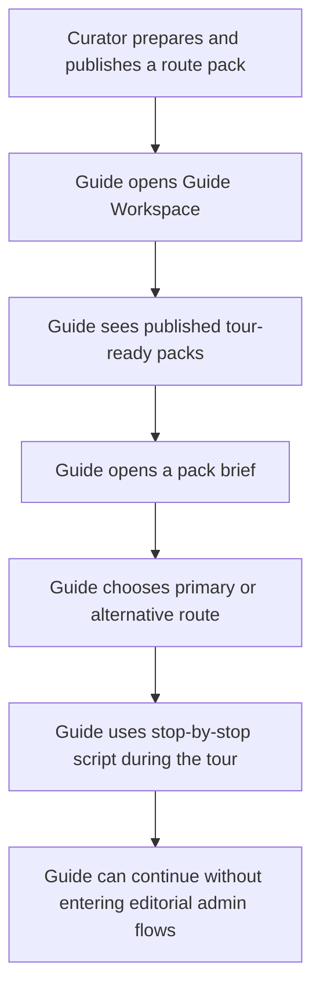

# Guide Workspace

## Problem Frame

The product now has a meaningful editorial workspace for administrators and curators, but it still has no clear role for people who actually conduct tours. That creates a gap: route packs already describe guided scenarios, points already contain `guideText`/facts, and routes already have map-ready structure, yet a guide cannot use the product as a live working tool without either entering admin flows or falling back to external notes.

This feature defines `Кабинет экскурсовода` as a dedicated operational workspace for running tours. In v1, the goal is not to turn guides into editors. The goal is to let a guide open prepared content, choose the best route variant for the current group, and use the app as a reliable tour brief during the walk.

## Requirements

**Positioning and Access**
- R1. The guide experience must be presented as a dedicated workspace named `Кабинет экскурсовода`, not as part of product-facing `админка` language.
- R2. The product must support a distinct guide role that can access the guide workspace without receiving full editorial or administrative permissions.
- R3. A guide must not be able to create, edit, publish, or delete routes, packs, rewards, or user data from the guide workspace.

**Pack-First Tour Execution**
- R4. The guide workspace must be centered on published route packs rather than on the raw route catalog, because packs already encode the intended tour scenario and route alternatives.
- R5. The guide landing view must show a compact list of published guide-usable packs with enough context to choose quickly: pack name, promise, short description, practical notes, and the available route variants.
- R6. Opening a pack must show a tour brief that keeps the guide in one flow: selected route, map/context preview, ordered stops, and the pack's practical notes.
- R7. When a pack contains primary and alternative routes, the guide must be able to switch between them inside the same pack context and see the editorial reason for each variant.

**Guide Materials and Fallbacks**
- R8. For each stop in the selected route, the guide workspace must surface the most useful available narration material from existing content, prioritizing dedicated guide text when present and falling back to point facts or descriptions when guide-specific copy is missing.
- R9. The workspace must make missing guide materials visible as gaps to the guide, but those gaps must not block tour use when fallback content exists.
- R10. The guide workspace must remain usable on a phone during a live tour, including quick scanning of the current route, upcoming stops, and practical notes without entering dense editorial screens.

**Role Boundaries and Content Eligibility**
- R11. Guide-visible content must be limited to packs that are already published and usable in the public experience; draft-only editorial content must stay outside the guide workspace.
- R12. If a published pack later becomes invalid for public use, it must no longer appear as a normal selectable item in the guide workspace.
- R13. Administrators and curators may continue to access the guide workspace for preview or support, but the guide workspace must not become the primary editing surface for them.

## Success Criteria

- A guide can conduct a tour using only the guide workspace and does not need access to route or pack CRUD screens.
- A guide can choose between primary and alternative route variants from the same pack without losing tour context.
- Existing published route packs become directly useful for real-world guided execution rather than only for consumer discovery.
- The product can explain the guide role in one sentence: "Экскурсовод проводит тур по подготовленным сценариям, не редактируя контент."
- Mobile use during a live walk remains practical enough that guides do not need a second notes tool for the basic tour script.

## Scope Boundaries

- The guide role is not a lighter version of admin CRUD.
- This v1 does not include guide marketplace, bookings, customer CRM, payments, attendance tracking, or freelancer discovery.
- This v1 does not include route or pack authoring by guides.
- This v1 does not require a full multilingual rollout, although future translated guide content may be consumed here.
- This v1 does not introduce AI authoring for guides; it consumes editorial content prepared elsewhere.

## Key Decisions

- Pack-first instead of route-first: route packs already encode the guided scenario, practical notes, and route switching logic, so they are the right entry point for guides.
- Guide as operator, not editor: this creates a meaningful new role instead of a fuzzy permission downgrade from admin.
- Read-only with smart fallback: the guide should still be able to run a tour when some dedicated guide copy is missing, using existing point facts and descriptions as backup.
- Separate naming from admin language: `Кабинет экскурсовода` makes the role legible to non-admin users and avoids treating guides as back-office staff.

## Dependencies / Assumptions

- Curators or administrators continue to prepare and publish route packs in the existing editorial workspace.
- Published route packs remain the main source of truth for whether a guided scenario is safe to expose.
- Existing point data (`guideText`, `facts`, `description`) is sufficient to power a useful first guided tour experience, even before a richer guide-content layer exists.

## Outstanding Questions

### Resolve Before Planning

- None.

### Deferred to Planning

- [Affects R2][Technical] Should the guide workspace live under a separate top-level route, or under the shared operations shell with role-based navigation?
- [Affects R5][Technical] What is the smallest pack summary needed for fast tour selection on mobile without reusing the heavy admin card layout?
- [Affects R8][Technical] How should the UI order and label fallback content when both `guideText` and generic point facts are present?
- [Affects R12][Needs research] Should invalid published packs disappear entirely for guides, or remain visible in a disabled/problem state for support scenarios?

## Next Steps

-> `/prompts:ce-plan` for structured implementation planning
