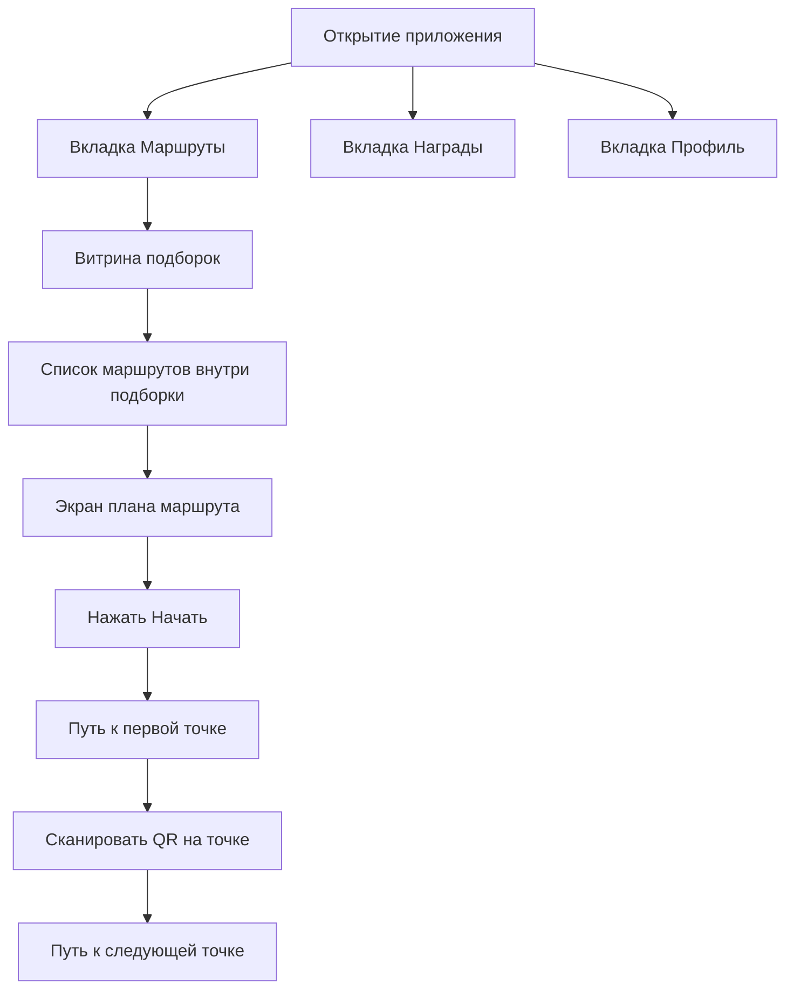

# Mobile Phone UI Refresh

## Problem Frame

Текущий продукт уже функционально покрывает маршруты, QR-сканирование, награды, профиль, guide/admin-вход и вспомогательные сценарии, но мобильный интерфейс ещё не воспринимается как цельный phone-first web app. Пользовательский опыт должен стать ближе к нативному приложению: быстрый вход в ключевые разделы, постоянная нижняя навигация, ясный сценарий маршрута и спокойный визуальный язык без перегруза геймификацией.

Главная задача этой итерации — определить мобильную информационную архитектуру и дизайн-поведение для телефона, чтобы потом можно было безопасно переработать UI в отдельной откатной ветке.

## Requirements

**Navigation**
- R1. На телефоне у приложения должна быть постоянная нижняя навигация из трёх вкладок: `Маршруты`, `Награды`, `Профиль`.
- R2. Активная вкладка должна быть визуально выделена как pill/капсула, а не только цветом текста.
- R3. По умолчанию приложение должно открываться на вкладке `Маршруты`.

**Routes IA**
- R4. Стартовый экран вкладки `Маршруты` должен показывать витрину подборок как основной контент первого экрана.
- R5. При входе в подборку пользователь должен сразу видеть список маршрутов этой подборки без отдельного hero-экрана подборки.
- R6. Карточка маршрута в мобильном списке должна включать обложку, название, короткое описание и мета-информацию, но не должна делать награды главным акцентом.
- R7. Баллы, обмен и другие reward-механики не должны визуально доминировать в сценарии выбора маршрута.

**Route Start and Run**
- R8. После выбора маршрута пользователь должен сначала видеть общий план маршрута, а не мгновенно попадать в режим прохождения без контекста.
- R9. Экран плана маршрута должен начинаться с обзора всей карты маршрута, а ниже показывать список точек с полезной информацией: адрес, время в пути и расстояние.
- R10. На экране плана маршрута должен быть явный главный action `Начать`.
- R11. После нажатия `Начать` интерфейс должен переводить пользователя в сценарий прохождения маршрута от текущего местоположения к первой точке.
- R12. После успешного сканирования QR на текущей точке интерфейс должен переводить пользователя к следующей точке маршрута до завершения всего сценария.
- R13. В активном маршруте карта должна оставаться главным слоем, но пользователь должен иметь возможность быстро скрыть и снова открыть её.
- R14. В активном маршруте кнопка `Сканировать QR` должна быть одним из двух главных акцентов экрана вместе с картой.

**Rewards Hub**
- R15. Вторая вкладка должна называться `Награды`.
- R16. Экран `Награды` должен быть хабом, где первым экраном идёт обмен/магазин.
- R17. Сразу после блока обмена/магазина должен идти компактный блок `Мои награды / достижения`.
- R18. Лидерборд должен оставаться постоянным блоком на главном экране `Награды`, а не отдельным скрытым разделом.
- R19. Блок `Мои награды / достижения` должен быть компактным и не превращаться в тяжёлую витрину достижений.
- R17. Вкладка `Награды` должна ощущаться отдельным слоем прогресса и обмена, а не центральным смыслом всего приложения.

**Profile**
- R20. Вкладка `Профиль` должна быть ориентирована в первую очередь на личные данные и настройки, а не на геймификацию.
- R21. В `Профиле` пользователь должен иметь возможность редактировать как минимум имя и настройки видимости в лидерборде.
- R22. Если у пользователя есть соответствующий доступ, из `Профиля` должен быть доступен переход в guide/admin-панели как отдельное действие.

**Visual Direction**
- R23. Общий мобильный визуальный язык должен быть спокойным, чистым и светлым, с большим количеством воздуха и акцентом на контент.
- R24. Интерфейс не должен строиться вокруг агрессивной геймификации; награды — это дополнительный слой, а не главный тон продукта.
- R25. Маршрутный сценарий должен ощущаться как сопровождающий и понятный, а не как перегруженный dashboard.

## Success Criteria

- Пользователь может с первого экрана понять основные разделы приложения и перейти между ними одной рукой через нижнюю навигацию.
- Выбор прогулки на телефоне ощущается быстрым и спокойным: подборка → маршрут → план → старт.
- Награды не мешают маршрутам, но остаются легко доступными в отдельной вкладке.
- Активный маршрут удерживает фокус на движении по карте и сканировании QR, без визуального шума.
- Профиль ощущается как понятный личный кабинет, а не как свалка второстепенных действий.

## Scope Boundaries

- В этой brainstorm-итерации не проектируем техническую реализацию карт и маршрутизации, только требуемое пользовательское поведение и роль карты в интерфейсе.
- Не обсуждаем backend, API, storage, permissions implementation или библиотечные решения.
- Не проектируем desktop-first redesign; фокус только на phone UI.
- Не переопределяем guide/admin как главные мобильные сценарии продукта; они остаются вторичными входами через роль и профиль.

## Key Decisions

- Нижняя навигация из трёх вкладок: это главный мобильный каркас, потому что продукт должен ощущаться как app-like оболочка, а не как длинная страница.
- `Награды`, а не `Магазин`: это точнее отражает лидерборд, баллы и обмен как единый прогресс-хаб.
- `Маршруты` стартуют с подборок: это даёт ясную витрину и не перегружает пользователя смешанным feed.
- Внутри подборки — только список маршрутов: телефонный сценарий должен быть быстрым, без лишней промежуточной “лендинг”-страницы.
- Перед стартом маршрута нужен обзор всего плана: это снижает тревожность и помогает понять путь до начала прохождения.
- В активном маршруте карта главная, но быстро скрываемая: навигация важна, но экран должен легко переключаться между “иду” и “сканирую”.
- Во вкладке `Награды` магазин идёт первым, затем компактные достижения, затем лидерборд: это удерживает баланс между обменом, личным прогрессом и соревнованием.
- Профиль строится от настроек, а не от баллов: это удерживает структуру приложения логичной и не превращает все вкладки в вариации reward-экрана.

## Dependencies / Assumptions

- Существующие мобильные сценарии уже живут в текущем web app и могут быть переработаны без изменения общей продуктовой роли маршрутов, QR и наград.
- Текущий продукт уже содержит отдельные поверхности для `Home`, `QRScanner`, `Shop`, `Leaderboard`, `Profile`, `GuideWorkspace`, поэтому redesign пойдёт как переупаковка IA и UI, а не как придуманный с нуля набор сущностей.
- Ветка для безопасного отката уже создана: `feat/mobile-design-exploration`.

## Outstanding Questions

### Resolve Before Planning
- [Affects R13][Design decision] Какой именно паттерн скрытия/раскрытия карты должен стать основным в активном маршруте: компактная шторка, sticky toggle, full-height collapse или segmented mode.

### Deferred to Planning
- [Affects R1][Technical] Как лучше встроить нижнюю навигацию в текущий React shell, не ломая admin/guide routing.
- [Affects R9][Technical] Как подготовить маршрутный экран к будущей интеграции карты, не проектируя её заново дважды.
- [Affects R20][Needs research] Какие profile actions уже существуют в текущем UI и что нужно перегруппировать, а не создавать заново.

## Next Steps
→ Resume `/prompts:ce-brainstorm` to resolve pattern of map collapse before planning, либо `/prompts:ce-plan`, если принять этот паттерн как implementation-time design decision
